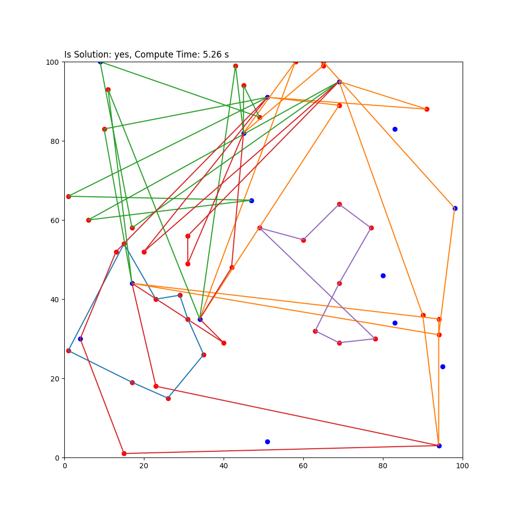

# BmTSP - Battery based Routing for UAVs in the mTSP using a Genetic Algorithm
> A Solver for the mTSP with battery constraints using a Genetic Algorithm



# Summary
This is a project created in the context of the Jugend Forscht competition in 2023/24. 
The solver is supposed to solve the mTSP with battery constraints using an two-phase approach.
The project is written in Python.    

# Installation
Just pull the Repository and have a fitting Python version on your PC. To install the requirements, just run the following command:
```
pip install -r requirements.txt
``` 
All code was written and tested in version ```Python 3.9```.

# Approach
I use a two-phase approach to solve the mTSP with battery constraints. 
1. **mTSP Solver**: use a Genetic Algorithm to solve the mTSP.
2. **Battery based Routing**: insert the charging stations into the mTSP solution to find a fitting solution. This part is currently using an Genetic Algorithm too, but I will try to find a better solution in the future. 

# Usage
To start using the solver, I advise to just run the following command:
```
python BmTSP-Solver/main.py -h
```
This will show you the help message and the possible arguments. If you want to run the solver with the default settings, just run the following command:
```
python BmTSP-Solver/main.py
```

# Found a bug? Want to add functionallity? Want to add other implementations?
If you would like to contribute to this small project in one or more of the following ways:
- Correct errors and fix bugs
- Implement further functionality and add functions
- Contribute another implementation in another programming language

If you want to contribute but don't know what to do, take a look at the issues; maybe you will find something fitting over there.

## How to contribute
Follow these steps to contribute to the project:
1. Fork the project
2. Make the changes
3. Set up a PR
4. Then wait until I or maybe others check and review the changes (this could take a while) 

## As this is a Jugend Forscht project
I will wait until the competition is over to accept any Contributions. But you can still contribute, I will just not
accept them until the competition is over.

# License
All code is licensed under the MIT license; please read the  for more information.
